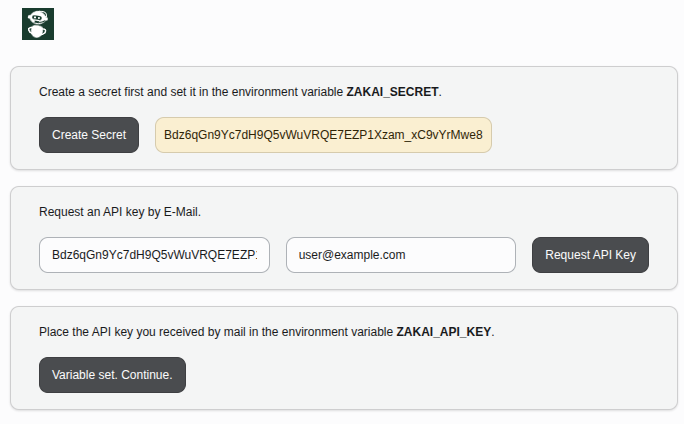
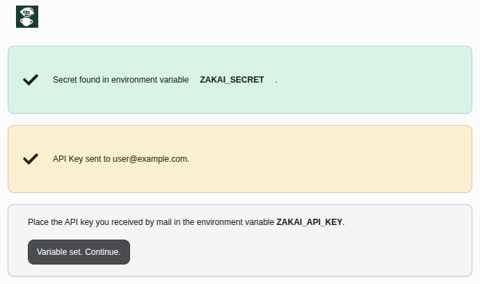
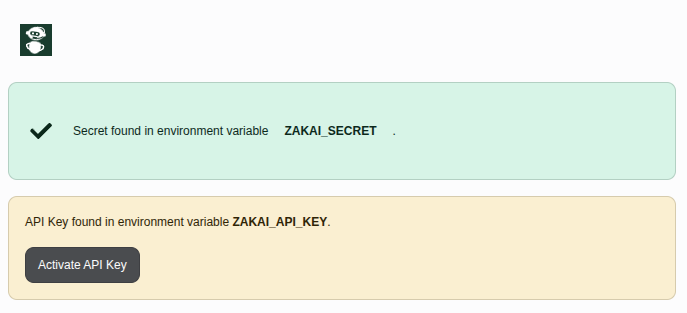
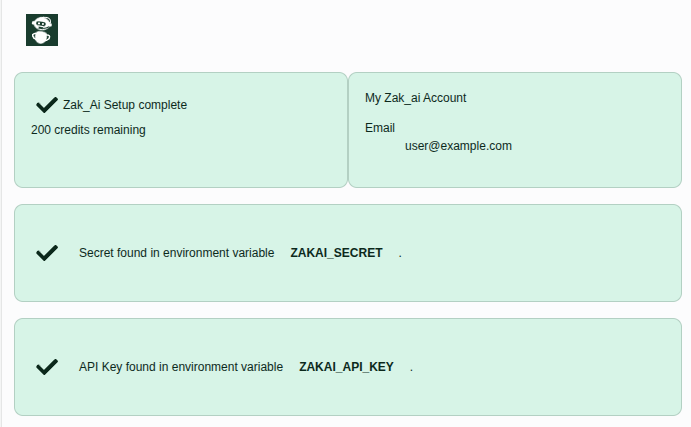
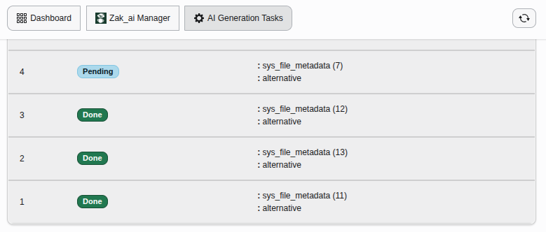

.. include:: /Includes.rst.txt

.. _usage-backend-module:

==============
Backend module
==============

The *Ai3* backend module is located under :guilabel:`Web > Ai3` in the
TYPO3 backend main menu. It provides three views accessible via the
sub-navigation:

.. _usage-dashboard:

Dashboard
=========

.. _usage-zakaimgmt:

Zak_ai management
=================

This Dashboard guides you through the Zak_ai registration process:

1. **Generate a Secret** and Provide an e-mail address.
2. Put this secret in the ``ZAKAI_SECRET'' environment variable.

3. **Request API key** — Sends a ``POST /accounts`` request to Zak_ai.
   The registration status changes to *Requested*. Zak_ai sends an email containing your api key.

4. **Save API key** After receiving the confirmation e-mail from
   Zak_ai, Put the API Key in the ``ZAKAI_API_KEY'' environment variable.
5. **Activate API key** Click *Activate API key* to call ``PUT /accounts``. The status
   changes to *Done*.

The dashboard looks like this when the registration is complete.

.. _usage-generatetask-view:

Generation task overview
========================

This view lists all ``GenerationTask`` records stored in the database.
Each row shows the capability, target record (table / field / UID),
current status, prompt, and generated result.

This view is intended for developers to see what the queue status looks like

See :ref:`developer-generation-task` for the full field reference.

